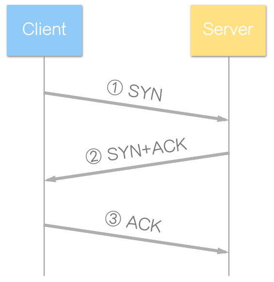

# A
### bandwidth 與 bps
```
1.bandwidth中文名為頻寬
2.bps 英文全名為 bit per second
3.指在一條資料傳輸路徑中，固定時間內所能容許的資料傳輸量
4.Bandwidth（頻寬）的單位為 Hz(Hertz, 赫茲)
```

### RFID
```
1.英文全名為 Radio Frequency IDentification
2.是一種無線通訊技術
3.可以通過無線電訊號識別特定目標並讀寫相關數據
4.無需識別系統與特定目標之間建立機械或者光學接觸
5.一些產品：悠遊卡、汽車防盜感應器、金融卡等等
```

### NFC
```
1.英文全名為 Near-field communication
2.是一種短距離高頻無線通訊技術
3.讓兩個電子裝置在相距幾公分之內進行通訊。
```

### cellular network
```
1.中文名為: 蜂巢式網路
2.是一種行動通訊硬體架構
3.各通訊基地台的訊號覆蓋呈六邊形，使整個網路看起來像一個蜂窩
```

### technology addiction
```
1.中文名為技術成癮
2.無法停止使用當今世界上存在的技術設備
3.最簡單的技術成癮就是很難放下手機
```

### Crowdsourcing vs Crowdfunding[比較題]
```
1.Crowdsourcing: 群眾外包 Crowdfunding:群眾募資
2.群眾外包: 是一種特定取得資源的模式
3.群眾募資: 是指個人或小企業通過網際網路向大眾募資的一種集資方式
```

###  metadata
```
是用來描述其他資料的資料
```
# B
### 1.解釋communication 
```
就是定義電腦間互相通訊且受共同認定的協議標準
```

### 2.Why Layering ?
```
在網路通訊的整個過程中，將整個流程系化開來，每一層完成各自的事情，互不干擾
```

### 列出 OSI Model 與 TCP/IP protocol 對應圖

### 5. TCP vs UDP
```
1.
TCP: Transmission Control Protocol
UDP: User Datagram Protocol

2.
TCP為relilable，傳輸前有建立連接利用確認重傳機制，數據合理分片和排序，流量控制，擁塞控制
UPD為un-relilable，不需要建立連接，直接傳輸不管有沒有遺失、接收

3.
錯誤重傳
```
4.

```
1.封包發起
2.封包接收與確認封包傳送
  回送確認封包
3.取得最後確認
```
### 6. 簡述下列網路設備主要功能與特色及運作在OSI哪一層?
```
1.
HUB: 集線器
主要功能:傳輸所有資料到所有裝置
特色：廣播式發送，共用帶寬
實體層

Repeater: 中斷器 
主要功能: 將衰減的訊號予以重整，使其恢復原本的波形與強度
特色：不考慮輸入訊號種類
實體層

2.
Switch: 交換器
連結多個網路
資料鏈結層

Bridge: 橋接器
連接兩個網路
資料鏈結層

3.
router
將資料封包(packet) 轉換為資料碼框
網路層

L3 Switch 
網路層

4.
Proxy
代替網站的主機伺服器， 直接透過代理主機提供相同的資訊， 以降低主機的使用率及節省網路頻寬
應用層
```

### 簡述下列address(位址)的意義與定義在OSI Model哪一層
```
MAC address: 每台電腦或裝置的硬體識別碼,它是獨一無二的        資料鏈結層
IP address: 是網際協定中用於標識傳送或接收資料報的裝置的一串數字     網路層
Port address: 一種經由軟體建立的服務，在一個電腦作業系統中扮演通訊的端點    傳輸層

```
